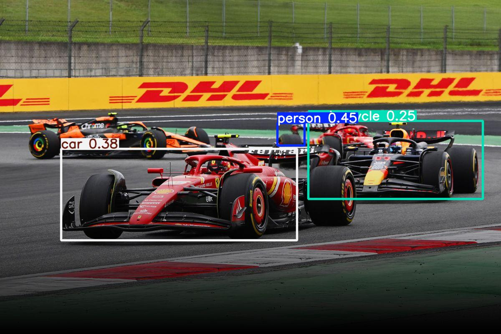
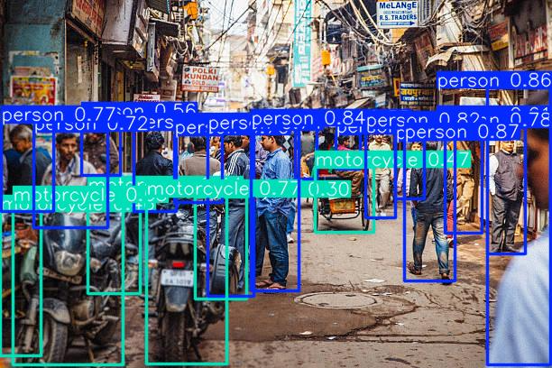
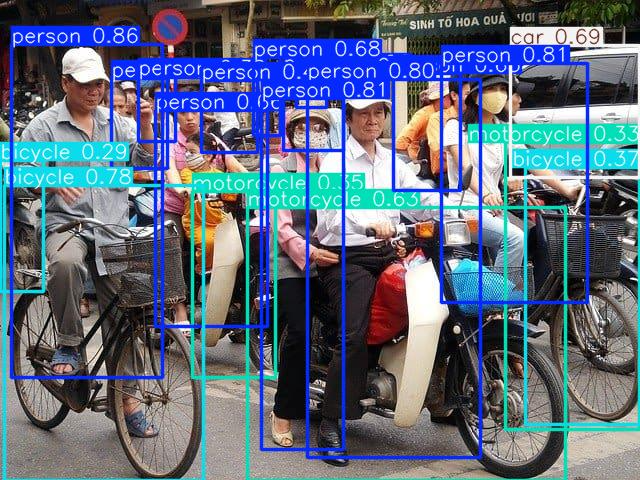

# YOLOv8 FastAPI Object Detection

## Project Overview

This project is a containerized FastAPI application for performing object detection using YOLOv8. It provides a REST API endpoint to upload images and returns detected objects in JSON format. The backend leverages the Ultralytics YOLOv8 model and is designed for easy deployment using Docker and Docker Compose.

---

## Features
- **Upload an image** via REST API and get object detection results.
- **YOLOv8** model for accurate and fast detection.
- **Containerized** with Docker for easy deployment.
- **Clean JSON response**: Only detection results, no file paths.

---

## Project Structure
```
AIMonks Labs Assessment/
├── README.md
├── Dockerfile
├── docker-compose.yml
├── images/
│   ├── exp1-input.png
│   ├── exp1-output.jpg
│   ├── exp2-input.png
│   ├── exp2-output.png
│   ├── exp3-input.png
│   └── exp3-output.png
├── src/
│   ├── Dockerfile
│   ├── docker-compose.yml
│   └── app/
│       ├── api/
│       │   └── main.py
│       ├── models/
│       │   └── yolo.py
│       ├── requirements.txt
│       └── utils/
│           └── file_utils.py
```

---

## Setup Instructions

### 1. Clone the Repository
```sh
git clone <your-repo-url>
cd "AIMonks Labs Assessment"
```


### 2. (Optional) Local Python Setup
If you want to run locally (not in Docker):
```sh
python3 -m venv venv
source venv/bin/activate
pip install -r app/requirements.txt
uvicorn app.api.main:app --reload
```

### 3. Docker Setup
#### Build and Run with Docker Compose
```sh
docker compose up --build
```
The API will be available at: http://localhost:8000

#### Build and Run with Docker only
```sh
docker build -t aimonks-fastapi-app .
docker run -p 8000:8000 aimonks-fastapi-app
```

---

## API Usage

### Endpoint: `/detect/`
- **Method:** POST
- **Content-Type:** multipart/form-data
- **Body:** `file` (image file)

#### Example Request (using `curl`):
```sh
curl -X POST "http://localhost:8000/detect/" \
  -H "accept: application/json" \
  -H "Content-Type: multipart/form-data" \
  -F "file=@sample1.jpg"
```

#### Example Input
An image file containing car and a person.

#### Expected Output
```json
{
  "detections": [
    {
      "name": "car",
      "confidence": 0.92,
      "xmin": 34,
      "ymin": 50,
      "xmax": 200,
      "ymax": 120
    },
    {
      "name": "person",
      "confidence": 0.88,
      "xmin": 210,
      "ymin": 60,
      "xmax": 260,
      "ymax": 180
    }
  ]
}
```

## Samples:

Input:

Output:

------------------------------------------
Input:

Output:

------------------------------------------
Input:

Output:

------------------------------------------


## Notes
- The API response contains only the detection results, not file paths.
- For best results, use clear images with visible objects.
---

## Troubleshooting
- If you get a `requirements.txt not found` error in Docker, ensure the Dockerfile copies from the correct path (`app/requirements.txt`).
- If you need to add more dependencies, update `app/requirements.txt` and rebuild the Docker image.
